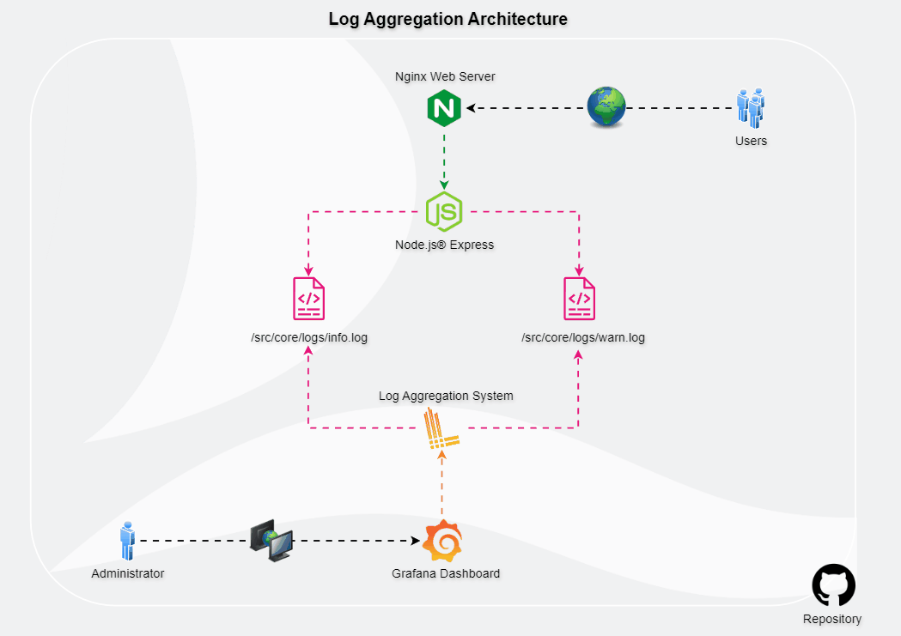
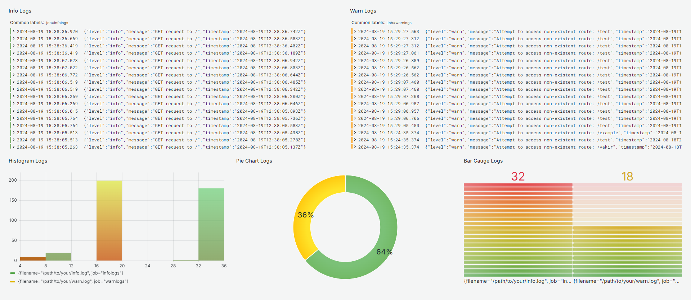

# Log Aggregation Project



## Overview

This project is a Node.js application built with Express that aggregates logs at different levels: **info** and **warning**. The logs are collected based on the type of HTTP request:

- **Info logs**: Collected from successful GET requests.
- **Warning logs**: Collected from undefined routes.

To manage and aggregate these logs, **Loki** and **Promtail** are used as Grafana tools to monitor the specific log files (`info.log` and `warn.log`), which are stored in the `/Log-Aggregation-Project/app/src/core/logs` directory.

For data visualization, the project integrates a **Grafana dashboard**, enabling real-time log monitoring, log counting, alerting, and more. The entire setup, including Grafana tools (Loki, Promtail, Grafana), has been Dockerized for easier deployment across different operating systems.

## Features

- **Log Aggregation**: Collects and stores logs at different levels.
- **Real-time Monitoring**: View logs as they come in.
- **Data Visualization**: Analyze logs using Grafana dashboards.
- **Alerts**: Set up alerts based on log events.
- **Dockerized**: Easy to deploy and run on any platform.

## Getting Started

### Prerequisites

- Node.js
- Docker
- Git

### 1. Clone the Repository

```bash
git clone <repository-url>
```

### 2. Run the Node.js Express Application

1. Navigate to the application directory:
   ```bash
   cd /Log-Aggregation-Project/app
   ```
2. Install the dependencies:
   ```bash
   npm install
   ```
3. Ensure port 8000 is available.
4. Start the application:
   ```bash
   npm start
   ```
5. Open your browser and go to `http://localhost:8000`.

### 3. Run the Log Aggregation System

1. Navigate to the Docker directory:
   ```bash
   cd /Log-Aggregation-Project/docker
   ```
2. Ensure ports 3100 & 3000 are available.
3. Run the Docker containers:
   ```bash
   docker-compose up -d
   ```
4. Open your browser and check the readiness of Loki:
   ```bash
   http://localhost:3100/ready
   ```
5. Wait for the response `"ready"`.
6. Access Grafana:
   ```bash
   http://localhost:3000
   ```
7. Log in using the default credentials:
   - **Username**: `admin`
   - **Password**: `admin`
8. Configure the data source:
   - Navigate to **Connections** -> **Data Sources**.
   - Select **Loki**.
   - Add the Loki Docker network URL:
     ```bash
     http://loki:3100
     ```
9. Import the dashboard:
   - Navigate to **Dashboard** -> **Import Dashboard**.
   - Copy the JSON model from the `/Log-Aggregation-Project/assets` directory.



## Enjoy!

Now you can monitor and manage your logs effectively using the Grafana dashboard. Watch live logs, count log entries, apply alerts, and more with ease.

Feel free to contribute and make this project even better!